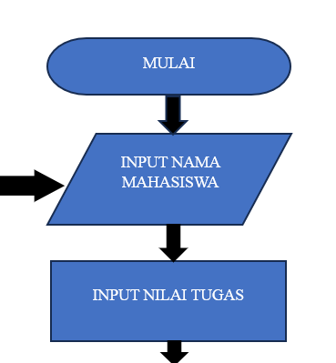

# LAPORAN PRAKTIKUM 5
DAFTAR ISI
==========
- [LAPORAN PRAKTIKUM 5](#laporan-praktikum-4) 
    - [PSEUDECODE PROGRAM DATA MAHASISWA](#pseudecode-program-data-mahasiswa)
    - [FLOWCHART DATA MAHASISWA](#flowchart-data-mahasisiswa)
    - [KESIMPULAN](#kesimpulan)

## PSEUDECODE PROGRAM DATA MAHASISWA
Berikut program sederhana dalam bahasa Python yang memenuhi kriteria yang Anda sebutkan untuk menambahkan data ke dalam sebuah list dan menghitung nilai akhir berdasarkan komponen nilai tugas, UTS, dan UAS.

### Step 1 : Menginisialisasi List Data Mahassiswa
Program ini dimulai dengan menginisialisasi sebuah list kosong bernama data_mahasiswa untuk menyimpan data setiap mahasiswa. List ini akan diisi dengan data mahasiswa yang diinput selama program berjalan :

### Step 2 : Input Data Mahasiswa dan Perulangan While
Program kemudian masuk ke dalam sebuah perulangan while yang memungkinkan pengguna untuk memasukkan data mahasiswa secara berulang hingga pengguna memilih untuk berhenti :

### Step 3 : Menghitung Nilai Akhir
Setelah menerima input nilai tugas, UTS, dan UAS, program menghitung nilai akhir mahasiswa dengan menggunakan formula berikut :

> dalam data program ini berarti:
> - Nilai tugas memiliki bobot 30% dari nilai akhir.
> - Nilai UTS memiliki bobot 35% dari nilai akhir.
> - Nilai UAS memiliki bobot 35% dari nilai akhir.

### Step 4 : Simpan Data Mahasiswa
Setelah nilai akhir dihitung, program membuat dictionary untuk menyimpan semua informasi tentang mahasiswa (nama, nim, nilai tugas, nilai UTS, nilai UAS, dan nilai akhir). Dictionary ini kemudian ditambahkan ke dalam list data_mahasiswa :

### Step 5 : Code Seleksi Untuk Tanyakan Tambahan Data Mahasiswa
Setelah menyimpan data, program bertanya kepada pengguna apakah ingin menambah data mahasiswa lagi atau tidak. If pengguna mengetik y, program akan mengulangi proses input. Jika pengguna mengetik t, perulangan akan berhenti, berikan perintah break untuk menghentikan Program :

### Step 6 : Print Data Mahasiswa
Setelah perulangan selesai (pengguna memilih t untuk berhenti menambah data), program akan menampilkan daftar data mahasiswa yang telah dimasukkan. Untuk setiap mahasiswa data yang ditampilkan meliputi nama, nim, nilai tugas, nilai UTS, nilai UAS, dan nilai akhir :

### Step 7 : Beri Batas Bawah
Print '=' dikalikan 90 :

### Step 8 : Test Code Program
Jalankan code program anda dengan memasukan nama, nim, nilai tugas, nilai uts, dan nilai uas :

## FLOWCHART DATA MAHASISWA
Berikut penjelasan rinci untuk setiap elemen dalam flowchart program yang telah anda buat. Penjelasan ini akan membantu Anda memahami fungsi dan tujuan dari setiap langkah dalam proses.

### Step 1 : Mulai
Menandakan titik awal dari program. Program akan mulai berjalan dari sini.

### Step 2 : Input Nama Mahasiswa
Pengguna diminta untuk memasukkan nama mahasiswa yang akan direkam. Ini adalah langkah awal untuk mengumpulkan data.

### Step 3 : Input Nilai Tugas
Pengguna diminta untuk memasukkan nilai tugas mahasiswa. Nilai ini akan digunakan untuk perhitungan nilai akhir.

### Step 4 : Input Nilai UTS
Pengguna diminta untuk memasukkan nilai Ujian Tengah Semester (UTS). Nilai ini juga berkontribusi pada perhitungan akhir.

### Step 5 : Input Nilai UAS
Pengguna diminta untuk memasukkan nilai Ujian Akhir Semester (UAS). Nilai ini akan menjadi bagian dari perhitungan nilai akhir.

### Step 6 : Hitung Nilai Akhir
Program menghitung nilai akhir berdasarkan rumus yang ditentukan, yaitu:

Dengan ini Nilai akhir ini akan disimpan bersama data mahasiswa.

### Step 7 : Simpan Data Mahasiswa
Data mahasiswa yang telah dimasukkan (nama dan nilai) disimpan dalam list atau struktur data yang sesuai. Ini penting untuk menampung semua data yang dikumpulkan

### Step 8 : Tanya Tambah Data
Program menanyakan kepada pengguna apakah mereka ingin menambah data mahasiswa lagi. Ini adalah titik keputusan dalam alur program.
- Cabang:
     - Ya (y) : Jika pengguna menjawab "ya", alur kembali ke langkah untuk memasukkan nama mahasiswa, sehingga pengguna dapat memasukkan data baru.
     - Tidak (t) : Jika pengguna menjawab "tidak", alur akan melanjutkan ke langkah berikutnya untuk menampilkan data.

### Step 9 : Tampilkan Daftar Mahasiswa 
Program akan menampilkan semua data mahasiswa yang telah disimpan, termasuk nama dan nilai akhir mereka. Ini memberikan ringkasan kepada pengguna tentang data yang telah dimasukkan.

### Step 10 : Selesai
Menandakan akhir dari program. Setelah daftar mahasiswa ditampilkan, program akan berhenti berjalan.

## KESIMPULAN
Dalam Praktikum ini penggunaan append dapat menambahkan element lain, jika anda perhatikan penggunaan perulangan sangat membantu untuk memastikan jika ada tambahan data yang diinputkan, namun dari semua itu semua dari kelas dalam sebuah List dari tema praktikum kali ini. Penggunaan List berguna untuk mengetahui apa saja yang ada di dalam data, List mampu menampung beberapa element berbeda.
